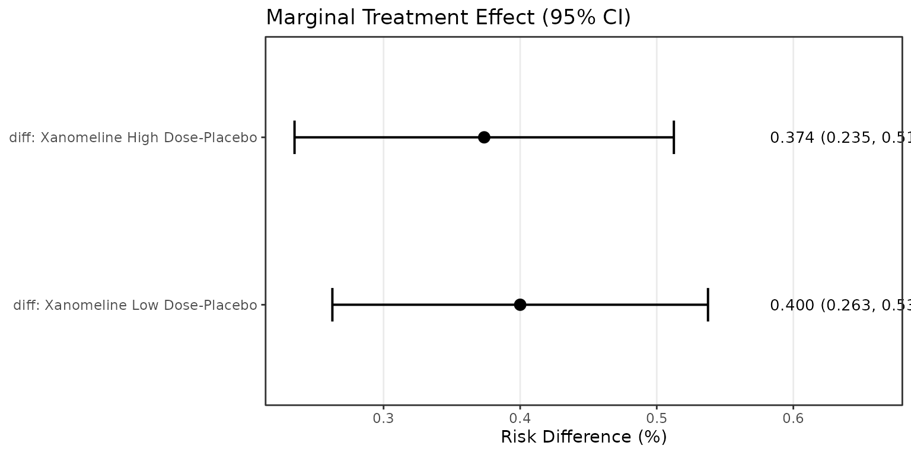

# Creating Clinical Trial Tables with beeca

## Overview

This vignette demonstrates how to create publication-ready clinical
trial tables from beeca analysis results. We cover:

1.  End-to-end analysis workflow from data to table
2.  Creating formatted tables with the [gt](https://gt.rstudio.com)
    package
3.  Adding titles, footnotes, and analysis set information
4.  Customizing table appearance for regulatory submissions

## Setup

``` r
library(beeca)
library(dplyr)
```

For the table examples, we use the [gt](https://gt.rstudio.com) package,
which produces HTML tables ideal for pkgdown websites and web-based
reports. For Word or PowerPoint output, consider the
[flextable](https://ardata-fr.github.io/flextable-book/) or
[huxtable](https://hughjonesd.github.io/huxtable/) packages, which can
consume the same
[`beeca_summary_table()`](https://openpharma.github.io/beeca/reference/beeca_summary_table.md)
output.

``` r
library(gt)
```

## Example Dataset

We use the `trial02_cdisc` dataset included in beeca, which follows
CDISC ADaM standards. This is a 3-arm clinical trial with Placebo and
two doses of Xanomeline.

``` r
# Prepare the analysis dataset
dat <- trial02_cdisc |>
  mutate(
    TRTP = factor(TRTP, levels = c("Placebo", "Xanomeline Low Dose", "Xanomeline High Dose"))
  )

# Review the data structure
dat |>
  group_by(TRTP) |>
  summarise(
    N = n(),
    Responders = sum(AVAL),
    `Response Rate (%)` = round(mean(AVAL) * 100, 1),
    .groups = "drop"
  )
#> # A tibble: 3 × 4
#>   TRTP                     N Responders `Response Rate (%)`
#>   <fct>                <int>      <dbl>               <dbl>
#> 1 Placebo                 86         29                33.7
#> 2 Xanomeline Low Dose     84         62                73.8
#> 3 Xanomeline High Dose    84         61                72.6
```

## End-to-End Analysis

### Step 1: Fit the Working Model

We fit a logistic regression model adjusting for baseline covariates
(sex, race, and age):

``` r
# Fit logistic regression with covariate adjustment
fit <- glm(
  AVAL ~ TRTP + SEX + RACE + AGE,
  family = binomial,
  data = dat
)

# Model summary
summary(fit)$coefficients[1:4, ]
#>                            Estimate  Std. Error    z value     Pr(>|z|)
#> (Intercept)              14.5929624 882.7441448 0.01653136 9.868105e-01
#> TRTPXanomeline Low Dose   1.7515730   0.3422890 5.11723420 3.100485e-07
#> TRTPXanomeline High Dose  1.6156307   0.3394837 4.75908216 1.944753e-06
#> SEXM                      0.2511626   0.2860867 0.87792487 3.799845e-01
```

### Step 2: Estimate Marginal Treatment Effect

Using the Ye et al. (2023) method for robust variance estimation:

``` r
# Calculate marginal treatment effect with risk difference contrast
marginal_fit <- get_marginal_effect(
  fit,
  trt = "TRTP",
  method = "Ye",
  contrast = "diff",
  reference = "Placebo"
)

# View the Analysis Results Data (ARD)
marginal_fit$marginal_results
#> # A tibble: 19 × 8
#>    TRTVAR TRTVAL                  PARAM ANALTYP1 STAT  STATVAL ANALMETH ANALDESC
#>    <chr>  <chr>                   <chr> <chr>    <chr>   <dbl> <chr>    <chr>   
#>  1 TRTP   Placebo                 AVAL  DESCRIP… N     86      count    Compute…
#>  2 TRTP   Placebo                 AVAL  DESCRIP… n     29      count    Compute…
#>  3 TRTP   Placebo                 AVAL  DESCRIP… %     33.7    percent… Compute…
#>  4 TRTP   Placebo                 AVAL  INFEREN… risk   0.343  g-compu… Compute…
#>  5 TRTP   Placebo                 AVAL  INFEREN… risk…  0.0519 Ye       Compute…
#>  6 TRTP   Xanomeline Low Dose     AVAL  DESCRIP… N     84      count    Compute…
#>  7 TRTP   Xanomeline Low Dose     AVAL  DESCRIP… n     62      count    Compute…
#>  8 TRTP   Xanomeline Low Dose     AVAL  DESCRIP… %     73.8    percent… Compute…
#>  9 TRTP   Xanomeline Low Dose     AVAL  INFEREN… risk   0.743  g-compu… Compute…
#> 10 TRTP   Xanomeline Low Dose     AVAL  INFEREN… risk…  0.0474 Ye       Compute…
#> 11 TRTP   Xanomeline High Dose    AVAL  DESCRIP… N     84      count    Compute…
#> 12 TRTP   Xanomeline High Dose    AVAL  DESCRIP… n     61      count    Compute…
#> 13 TRTP   Xanomeline High Dose    AVAL  DESCRIP… %     72.6    percent… Compute…
#> 14 TRTP   Xanomeline High Dose    AVAL  INFEREN… risk   0.716  g-compu… Compute…
#> 15 TRTP   Xanomeline High Dose    AVAL  INFEREN… risk…  0.0484 Ye       Compute…
#> 16 TRTP   diff: Xanomeline Low D… AVAL  INFEREN… diff   0.400  g-compu… Compute…
#> 17 TRTP   diff: Xanomeline Low D… AVAL  INFEREN… diff…  0.0702 Ye       Compute…
#> 18 TRTP   diff: Xanomeline High … AVAL  INFEREN… diff   0.374  g-compu… Compute…
#> 19 TRTP   diff: Xanomeline High … AVAL  INFEREN… diff…  0.0708 Ye       Compute…
```

### Step 3: Review Results

The beeca package provides several ways to view results:

``` r
# Concise print output
print(marginal_fit)
#> beeca: Covariate-Adjusted Marginal Treatment Effect
#> =======================================================
#> 
#> 2 treatment comparisons:
#> 
#>   diff: Xanomeline Low Dose-Placebo:
#>     Estimate = 0.4000 (SE = 0.0702), p = 1.185e-08
#>   diff: Xanomeline High Dose-Placebo:
#>     Estimate = 0.3737 (SE = 0.0708), p = 1.332e-07
#> 
#> Use summary() for detailed results
#> Use tidy() for broom-compatible output
#> Use plot() for visualizations

# Detailed summary with confidence intervals
summary(marginal_fit, conf.level = 0.95)
#> 
#> Covariate-Adjusted Marginal Treatment Effect Analysis
#> ============================================================
#> 
#> Model Information:
#> ------------------------------------------------------------
#>   Working model:      Logistic regression with covariate adjustment
#>   Variance estimator: Ye
#>   Contrast type:      diff
#>   Sample size:        254
#>   Outcome variable:   AVAL
#> 
#> Marginal Risks (g-computation):
#> ------------------------------------------------------------
#>  Treatment            Risk   SE     95% CI          
#>  Placebo              0.3428 0.0519 (0.2411, 0.4445)
#>  Xanomeline Low Dose  0.7428 0.0474 (0.6499, 0.8357)
#>  Xanomeline High Dose 0.7165 0.0484 (0.6216, 0.8114)
#> 
#> Treatment Effect Estimates:
#> ------------------------------------------------------------
#>  Comparison                         Estimate SE     Z value 95% CI          
#>  diff: Xanomeline Low Dose-Placebo  0.4000   0.0702 5.6980  (0.2624, 0.5376)
#>  diff: Xanomeline High Dose-Placebo 0.3737   0.0708 5.2782  (0.2349, 0.5125)
#>  P value
#>  1.2e-08
#>  1.3e-07
#> 
#> ------------------------------------------------------------
#> Note: Standard errors and tests based on robust variance estimation
#> Use tidy() for data frame output or plot() for visualizations
```

Using the broom-style
[`tidy()`](https://generics.r-lib.org/reference/tidy.html) method:

``` r
# Tidy data frame output
tidy(marginal_fit, conf.int = TRUE, include_marginal = TRUE)
#> # A tibble: 5 × 7
#>   term                  estimate std.error statistic  p.value conf.low conf.high
#>   <chr>                    <dbl>     <dbl>     <dbl>    <dbl>    <dbl>     <dbl>
#> 1 risk_Placebo             0.343    0.0519      6.61 3.96e-11    0.241     0.445
#> 2 risk_Xanomeline Low …    0.743    0.0474     15.7  2.96e-55    0.650     0.836
#> 3 risk_Xanomeline High…    0.716    0.0484     14.8  1.34e-49    0.622     0.811
#> 4 diff: Xanomeline Hig…    0.374    0.0708      5.27 1.33e- 7    0.235     0.513
#> 5 diff: Xanomeline Low…    0.400    0.0702      5.70 1.19e- 8    0.263     0.538
```

## Creating Clinical Trial Tables with gt

### Basic Table

The [`as_gt()`](https://openpharma.github.io/beeca/reference/as_gt.md)
function converts beeca results directly to a formatted gt table:

``` r
as_gt(marginal_fit)
```

| Treatment                                                                         | N   | Responders | Estimate (%) | 95% CI         | P-value |
|-----------------------------------------------------------------------------------|-----|------------|--------------|----------------|---------|
| Marginal Risk                                                                     |     |            |              |                |         |
| Placebo                                                                           | 86  | 29         | 34.3         | (24.1, 44.5)   |         |
| Xanomeline Low Dose                                                               | 84  | 62         | 74.3         | (65.0, 83.6)   | NA      |
| Xanomeline High Dose                                                              | 84  | 61         | 71.6         | (62.2, 81.1)   | NA      |
| Risk Difference                                                                   |     |            |              |                |         |
| diff: Xanomeline Low Dose-Placebo                                                 |     |            | 40.00        | (26.25, 53.75) | \<0.001 |
| diff: Xanomeline High Dose-Placebo                                                |     |            | 37.37        | (23.48, 51.25) | \<0.001 |
| Marginal risks estimated using g-computation. Variance estimated using Ye method. |     |            |              |                |         |

### Publication-Ready Table with Metadata

Add title, footnotes, and analysis set information for regulatory
submissions:

``` r
as_gt(
  marginal_fit,
  title = "Table 14.2.1: Primary Efficacy Analysis",
  subtitle = "Response Rate by Treatment Group - Risk Difference",
  source_note = "Covariate-adjusted analysis using logistic regression with g-computation.",
  analysis_set = "Full Analysis Set (FAS)"
)
```

| Table 14.2.1: Primary Efficacy Analysis                                           |     |            |              |                |         |
|-----------------------------------------------------------------------------------|-----|------------|--------------|----------------|---------|
| Response Rate by Treatment Group - Risk Difference                                |     |            |              |                |         |
| Treatment                                                                         | N   | Responders | Estimate (%) | 95% CI         | P-value |
| Marginal Risk                                                                     |     |            |              |                |         |
| Placebo                                                                           | 86  | 29         | 34.3         | (24.1, 44.5)   |         |
| Xanomeline Low Dose                                                               | 84  | 62         | 74.3         | (65.0, 83.6)   | NA      |
| Xanomeline High Dose                                                              | 84  | 61         | 71.6         | (62.2, 81.1)   | NA      |
| Risk Difference                                                                   |     |            |              |                |         |
| diff: Xanomeline Low Dose-Placebo                                                 |     |            | 40.00        | (26.25, 53.75) | \<0.001 |
| diff: Xanomeline High Dose-Placebo                                                |     |            | 37.37        | (23.48, 51.25) | \<0.001 |
| Full Analysis Set (FAS) (N = 254)                                                 |     |            |              |                |         |
| Covariate-adjusted analysis using logistic regression with g-computation.         |     |            |              |                |         |
| Marginal risks estimated using g-computation. Variance estimated using Ye method. |     |            |              |                |         |

### Customizing Table Options

Control confidence level, decimal places, and display options:

``` r
as_gt(
  marginal_fit,
  title = "Table 14.2.1.1: Sensitivity Analysis",
  subtitle = "Response Rate with 90% Confidence Intervals",
  conf.level = 0.90,
  risk_digits = 2,
  effect_digits = 3,
  analysis_set = "Per Protocol Set (PPS)",
  analysis_set_n = 240,
  source_note = "Per protocol analysis excludes major protocol deviations."
)
```

| Table 14.2.1.1: Sensitivity Analysis                                              |     |            |              |                  |         |
|-----------------------------------------------------------------------------------|-----|------------|--------------|------------------|---------|
| Response Rate with 90% Confidence Intervals                                       |     |            |              |                  |         |
| Treatment                                                                         | N   | Responders | Estimate (%) | 90% CI           | P-value |
| Marginal Risk                                                                     |     |            |              |                  |         |
| Placebo                                                                           | 86  | 29         | 34.28        | (25.74, 42.82)   |         |
| Xanomeline Low Dose                                                               | 84  | 62         | 74.28        | (66.48, 82.09)   | NA      |
| Xanomeline High Dose                                                              | 84  | 61         | 71.65        | (63.69, 79.61)   | NA      |
| Risk Difference                                                                   |     |            |              |                  |         |
| diff: Xanomeline Low Dose-Placebo                                                 |     |            | 40.002       | (28.462, 51.542) | \<0.001 |
| diff: Xanomeline High Dose-Placebo                                                |     |            | 37.368       | (25.714, 49.021) | \<0.001 |
| Per Protocol Set (PPS) (N = 240)                                                  |     |            |              |                  |         |
| Per protocol analysis excludes major protocol deviations.                         |     |            |              |                  |         |
| Marginal risks estimated using g-computation. Variance estimated using Ye method. |     |            |              |                  |         |

### Displaying Results as Proportions

By default, risks are displayed as percentages. Use
`risk_percent = FALSE` for proportions:

``` r
as_gt(
  marginal_fit,
  title = "Table 14.2.2: Response Proportions",
  risk_percent = FALSE,
  effect_digits = 4,
  analysis_set = "Full Analysis Set (FAS)"
)
```

| Table 14.2.2: Response Proportions                                                |     |            |          |                  |         |
|-----------------------------------------------------------------------------------|-----|------------|----------|------------------|---------|
| Treatment                                                                         | N   | Responders | Estimate | 95% CI           | P-value |
| Marginal Risk                                                                     |     |            |          |                  |         |
| Placebo                                                                           | 86  | 29         | 0.3      | (0.2, 0.4)       |         |
| Xanomeline Low Dose                                                               | 84  | 62         | 0.7      | (0.6, 0.8)       | NA      |
| Xanomeline High Dose                                                              | 84  | 61         | 0.7      | (0.6, 0.8)       | NA      |
| Risk Difference                                                                   |     |            |          |                  |         |
| diff: Xanomeline Low Dose-Placebo                                                 |     |            | 0.4000   | (0.2625, 0.5375) | \<0.001 |
| diff: Xanomeline High Dose-Placebo                                                |     |            | 0.3737   | (0.2348, 0.5125) | \<0.001 |
| Full Analysis Set (FAS) (N = 254)                                                 |     |            |          |                  |         |
| Marginal risks estimated using g-computation. Variance estimated using Ye method. |     |            |          |                  |         |

## Alternative Contrasts

### Risk Ratio

``` r
# Fit with risk ratio contrast
fit_rr <- get_marginal_effect(
  fit,
  trt = "TRTP",
  method = "Ye",
  contrast = "rr",
  reference = "Placebo"
)

# Summary
summary(fit_rr)
#> 
#> Covariate-Adjusted Marginal Treatment Effect Analysis
#> ============================================================
#> 
#> Model Information:
#> ------------------------------------------------------------
#>   Working model:      Logistic regression with covariate adjustment
#>   Variance estimator: Ye
#>   Contrast type:      rr
#>   Sample size:        254
#>   Outcome variable:   AVAL
#> 
#> Marginal Risks (g-computation):
#> ------------------------------------------------------------
#>  Treatment            Risk   SE     95% CI          
#>  Placebo              0.3428 0.0519 (0.2411, 0.4445)
#>  Xanomeline Low Dose  0.7428 0.0474 (0.6499, 0.8357)
#>  Xanomeline High Dose 0.7165 0.0484 (0.6216, 0.8114)
#> 
#> Treatment Effect Estimates:
#> ------------------------------------------------------------
#>  Comparison                       Estimate SE     Z value 95% CI          
#>  rr: Xanomeline Low Dose/Placebo  2.1669   0.3555 6.0954  (1.4701, 2.8637)
#>  rr: Xanomeline High Dose/Placebo 2.0901   0.3461 6.0390  (1.4118, 2.7684)
#>  P value
#>  1.1e-09
#>  1.6e-09
#> 
#> ------------------------------------------------------------
#> Note: Standard errors and tests based on robust variance estimation
#> Use tidy() for data frame output or plot() for visualizations
```

``` r
as_gt(
  fit_rr,
  title = "Table 14.2.3: Risk Ratio Analysis",
  analysis_set = "Full Analysis Set (FAS)",
  source_note = "Risk ratios >1 indicate higher response in active treatment."
)
```

| Table 14.2.3: Risk Ratio Analysis                                                 |     |            |              |              |         |
|-----------------------------------------------------------------------------------|-----|------------|--------------|--------------|---------|
| Treatment                                                                         | N   | Responders | Estimate (%) | 95% CI       | P-value |
| Marginal Risk                                                                     |     |            |              |              |         |
| Placebo                                                                           | 86  | 29         | 34.3         | (24.1, 44.5) |         |
| Xanomeline Low Dose                                                               | 84  | 62         | 74.3         | (65.0, 83.6) | NA      |
| Xanomeline High Dose                                                              | 84  | 61         | 71.6         | (62.2, 81.1) | NA      |
| Risk Ratio                                                                        |     |            |              |              |         |
| rr: Xanomeline Low Dose/Placebo                                                   |     |            | 2.17         | (1.47, 2.86) | \<0.001 |
| rr: Xanomeline High Dose/Placebo                                                  |     |            | 2.09         | (1.41, 2.77) | \<0.001 |
| Full Analysis Set (FAS) (N = 254)                                                 |     |            |              |              |         |
| Risk ratios \>1 indicate higher response in active treatment.                     |     |            |              |              |         |
| Marginal risks estimated using g-computation. Variance estimated using Ye method. |     |            |              |              |         |

### Odds Ratio

``` r
# Fit with odds ratio contrast
fit_or <- get_marginal_effect(
  fit,
  trt = "TRTP",
  method = "Ye",
  contrast = "or",
  reference = "Placebo"
)

summary(fit_or)
#> 
#> Covariate-Adjusted Marginal Treatment Effect Analysis
#> ============================================================
#> 
#> Model Information:
#> ------------------------------------------------------------
#>   Working model:      Logistic regression with covariate adjustment
#>   Variance estimator: Ye
#>   Contrast type:      or
#>   Sample size:        254
#>   Outcome variable:   AVAL
#> 
#> Marginal Risks (g-computation):
#> ------------------------------------------------------------
#>  Treatment            Risk   SE     95% CI          
#>  Placebo              0.3428 0.0519 (0.2411, 0.4445)
#>  Xanomeline Low Dose  0.7428 0.0474 (0.6499, 0.8357)
#>  Xanomeline High Dose 0.7165 0.0484 (0.6216, 0.8114)
#> 
#> Treatment Effect Estimates:
#> ------------------------------------------------------------
#>  Comparison                                     Estimate SE     Z value
#>  or: odds(Xanomeline Low Dose) / odds(Placebo)  5.5374   1.8715 2.9588 
#>  or: odds(Xanomeline High Dose) / odds(Placebo) 4.8448   1.6030 3.0223 
#>  95% CI           P value
#>  (1.8693, 9.2055) 0.0031 
#>  (1.7030, 7.9866) 0.0025 
#> 
#> ------------------------------------------------------------
#> Note: Standard errors and tests based on robust variance estimation
#> Use tidy() for data frame output or plot() for visualizations
```

``` r
as_gt(
  fit_or,
  title = "Table 14.2.4: Odds Ratio Analysis",
  analysis_set = "Full Analysis Set (FAS)",
  source_note = "Marginal odds ratios from g-computation."
)
```

| Table 14.2.4: Odds Ratio Analysis                                                 |     |            |              |              |         |
|-----------------------------------------------------------------------------------|-----|------------|--------------|--------------|---------|
| Treatment                                                                         | N   | Responders | Estimate (%) | 95% CI       | P-value |
| Marginal Risk                                                                     |     |            |              |              |         |
| Placebo                                                                           | 86  | 29         | 34.3         | (24.1, 44.5) |         |
| Xanomeline Low Dose                                                               | 84  | 62         | 74.3         | (65.0, 83.6) | NA      |
| Xanomeline High Dose                                                              | 84  | 61         | 71.6         | (62.2, 81.1) | NA      |
| Odds Ratio                                                                        |     |            |              |              |         |
| or: odds(Xanomeline Low Dose) / odds(Placebo)                                     |     |            | 5.54         | (1.87, 9.21) | 0.003   |
| or: odds(Xanomeline High Dose) / odds(Placebo)                                    |     |            | 4.84         | (1.70, 7.99) | 0.003   |
| Full Analysis Set (FAS) (N = 254)                                                 |     |            |              |              |         |
| Marginal odds ratios from g-computation.                                          |     |            |              |              |         |
| Marginal risks estimated using g-computation. Variance estimated using Ye method. |     |            |              |              |         |

## Working with the Summary Table Helper

For more flexibility, use
[`beeca_summary_table()`](https://openpharma.github.io/beeca/reference/beeca_summary_table.md)
to get structured data frames:

``` r
# Get structured summary data
summary_data <- beeca_summary_table(marginal_fit, conf.level = 0.95)

# Per-arm statistics
summary_data$arm_statistics
#> # A tibble: 3 × 8
#>   treatment          N n_responders observed_rate marginal_risk marginal_risk_se
#>   <chr>          <dbl>        <dbl>         <dbl>         <dbl>            <dbl>
#> 1 Placebo           86           29          33.7          34.3             5.19
#> 2 Xanomeline Lo…    84           62          73.8          74.3             4.74
#> 3 Xanomeline Hi…    84           61          72.6          71.6             4.84
#> # ℹ 2 more variables: marginal_risk_ci_low <dbl>, marginal_risk_ci_high <dbl>

# Treatment effect estimates
summary_data$treatment_effects
#> # A tibble: 2 × 7
#>   comparison               estimate std_error ci_low ci_high z_statistic p_value
#>   <chr>                       <dbl>     <dbl>  <dbl>   <dbl>       <dbl>   <dbl>
#> 1 diff: Xanomeline Low Do…     40.0      7.02   26.3    53.8        5.70 1.19e-8
#> 2 diff: Xanomeline High D…     37.4      7.08   23.5    51.3        5.27 1.33e-7

# Analysis metadata
summary_data$metadata
#> $conf_level
#> [1] 0.95
#> 
#> $contrast_type
#> [1] "diff"
#> 
#> $variance_method
#> [1] "Ye"
#> 
#> $reference
#> [1] "Placebo"
#> 
#> $n_total
#> [1] 254
#> 
#> $risk_percent
#> [1] TRUE
```

This allows custom table creation with any table package:

``` r
# Custom table from summary data
summary_data$treatment_effects |>
  mutate(
    CI = sprintf("(%.2f, %.2f)", ci_low, ci_high),
    `P-value` = format_pvalue(p_value)
  ) |>
  select(Comparison = comparison, Estimate = estimate, `Std. Error` = std_error, CI, `P-value`) |>
  gt() |>
  tab_header(
    title = "Treatment Effect Summary",
    subtitle = "Risk Difference (%) vs Placebo"
  ) |>
  fmt_number(columns = c(Estimate, `Std. Error`), decimals = 2)
```

| Treatment Effect Summary           |          |            |                |         |
|------------------------------------|----------|------------|----------------|---------|
| Risk Difference (%) vs Placebo     |          |            |                |         |
| Comparison                         | Estimate | Std. Error | CI             | P-value |
| diff: Xanomeline Low Dose-Placebo  | 40.00    | 7.02       | (26.25, 53.75) | \<0.001 |
| diff: Xanomeline High Dose-Placebo | 37.37    | 7.08       | (23.48, 51.25) | \<0.001 |

## Using beeca_fit() for Streamlined Workflow

The
[`beeca_fit()`](https://openpharma.github.io/beeca/reference/beeca_fit.md)
function provides a simplified interface:

``` r
# One-step analysis
result <- beeca_fit(
  data = dat,
  outcome = "AVAL",
  treatment = "TRTP",
  covariates = c("SEX", "RACE", "AGE"),
  method = "Ye",
  contrast = "diff",
  reference = "Placebo"
)
#> Fitting logistic regression with 3 covariate(s)
#> Computing marginal effects (method: Ye, contrast: diff)
#> Analysis complete!

# Same output methods work
summary(result)
#> 
#> Covariate-Adjusted Marginal Treatment Effect Analysis
#> ============================================================
#> 
#> Model Information:
#> ------------------------------------------------------------
#>   Working model:      Logistic regression with covariate adjustment
#>   Variance estimator: Ye
#>   Contrast type:      diff
#>   Sample size:        254
#>   Outcome variable:   AVAL
#> 
#> Marginal Risks (g-computation):
#> ------------------------------------------------------------
#>  Treatment            Risk   SE     95% CI          
#>  Placebo              0.3428 0.0519 (0.2411, 0.4445)
#>  Xanomeline Low Dose  0.7428 0.0474 (0.6499, 0.8357)
#>  Xanomeline High Dose 0.7165 0.0484 (0.6216, 0.8114)
#> 
#> Treatment Effect Estimates:
#> ------------------------------------------------------------
#>  Comparison                         Estimate SE     Z value 95% CI          
#>  diff: Xanomeline Low Dose-Placebo  0.4000   0.0702 5.6980  (0.2624, 0.5376)
#>  diff: Xanomeline High Dose-Placebo 0.3737   0.0708 5.2782  (0.2349, 0.5125)
#>  P value
#>  1.2e-08
#>  1.3e-07
#> 
#> ------------------------------------------------------------
#> Note: Standard errors and tests based on robust variance estimation
#> Use tidy() for data frame output or plot() for visualizations
```

``` r
as_gt(
  result,
  title = "Table 14.2.5: Primary Analysis (beeca_fit)",
  analysis_set = "Full Analysis Set (FAS)",
  source_note = "Analysis performed using beeca_fit() convenience function."
)
```

| Table 14.2.5: Primary Analysis (beeca_fit)                                        |     |            |              |                |         |
|-----------------------------------------------------------------------------------|-----|------------|--------------|----------------|---------|
| Treatment                                                                         | N   | Responders | Estimate (%) | 95% CI         | P-value |
| Marginal Risk                                                                     |     |            |              |                |         |
| Placebo                                                                           | 86  | 29         | 34.3         | (24.1, 44.5)   |         |
| Xanomeline Low Dose                                                               | 84  | 62         | 74.3         | (65.0, 83.6)   | NA      |
| Xanomeline High Dose                                                              | 84  | 61         | 71.6         | (62.2, 81.1)   | NA      |
| Risk Difference                                                                   |     |            |              |                |         |
| diff: Xanomeline Low Dose-Placebo                                                 |     |            | 40.00        | (26.25, 53.75) | \<0.001 |
| diff: Xanomeline High Dose-Placebo                                                |     |            | 37.37        | (23.48, 51.25) | \<0.001 |
| Full Analysis Set (FAS) (N = 254)                                                 |     |            |              |                |         |
| Analysis performed using beeca_fit() convenience function.                        |     |            |              |                |         |
| Marginal risks estimated using g-computation. Variance estimated using Ye method. |     |            |              |                |         |

## Comparing Variance Methods

Compare results between Ye et al. and Ge et al. methods:

``` r
# Ye method (recommended for marginal/unconditional estimand)
fit_ye <- get_marginal_effect(fit, trt = "TRTP", method = "Ye",
                               contrast = "diff", reference = "Placebo")

# Ge method (for conditional estimand)
fit_ge <- get_marginal_effect(fit, trt = "TRTP", method = "Ge", type = "HC0",
                               contrast = "diff", reference = "Placebo")
#> Warning in meatHC(x, type = type, omega = omega): HC0 covariances become (close
#> to) singular if hat values are (close to) 1 as for observation(s) 24

# Compare standard errors
comparison <- data.frame(
  Method = c("Ye et al. (2023)", "Ge et al. (2011)"),
  SE_LowDose = c(fit_ye$marginal_se[1], fit_ge$marginal_se[1]),
  SE_HighDose = c(fit_ye$marginal_se[2], fit_ge$marginal_se[2])
)
comparison
#>             Method SE_LowDose SE_HighDose
#> 1 Ye et al. (2023) 0.07015665  0.07084826
#> 2 Ge et al. (2011) 0.06935188  0.07168090
```

## Forest Plot Visualization

Complement tables with forest plots:

``` r
# Forest plot of treatment effects
plot(marginal_fit,
     main = "Treatment Effect: Risk Difference vs Placebo",
     xlab = "Risk Difference (%)")
```



## Complete Reporting Example

Here’s a complete workflow for a regulatory submission:

``` r
# 1. Define analysis population
analysis_data <- trial02_cdisc |>
  filter(FASFL == "Y") |>  # Full Analysis Set flag
  mutate(TRTP = factor(TRTP, levels = c("Placebo", "Xanomeline Low Dose", "Xanomeline High Dose")))

n_fas <- nrow(analysis_data)

# 2. Fit model and estimate treatment effect
primary_analysis <- glm(
  AVAL ~ TRTP + SEX + RACE + AGE,
  family = binomial,
  data = analysis_data
) |>
  get_marginal_effect(
    trt = "TRTP",
    method = "Ye",
    contrast = "diff",
    reference = "Placebo"
  )

# 3. Create primary efficacy table
as_gt(
  primary_analysis,
  title = "Table 14.2.1: Primary Efficacy Analysis",
  subtitle = "Response Rate by Treatment Group",
  analysis_set = "Full Analysis Set (FAS)",
  analysis_set_n = n_fas,
  conf.level = 0.95,
  risk_digits = 1,
  effect_digits = 2,
  source_note = paste(
    "Response defined as AVAL = 1.",
    "Risk difference estimated using g-computation with robust variance estimation (Ye et al. 2023).",
    "Model adjusted for sex, race, and age at baseline.",
    sep = " "
  )
)
```

| Table 14.2.1: Primary Efficacy Analysis                                                                                                                                          |     |            |              |                |         |
|----------------------------------------------------------------------------------------------------------------------------------------------------------------------------------|-----|------------|--------------|----------------|---------|
| Response Rate by Treatment Group                                                                                                                                                 |     |            |              |                |         |
| Treatment                                                                                                                                                                        | N   | Responders | Estimate (%) | 95% CI         | P-value |
| Marginal Risk                                                                                                                                                                    |     |            |              |                |         |
| Placebo                                                                                                                                                                          | 86  | 29         | 34.3         | (24.1, 44.5)   |         |
| Xanomeline Low Dose                                                                                                                                                              | 84  | 62         | 74.3         | (65.0, 83.6)   | NA      |
| Xanomeline High Dose                                                                                                                                                             | 84  | 61         | 71.6         | (62.2, 81.1)   | NA      |
| Risk Difference                                                                                                                                                                  |     |            |              |                |         |
| diff: Xanomeline Low Dose-Placebo                                                                                                                                                |     |            | 40.00        | (26.25, 53.75) | \<0.001 |
| diff: Xanomeline High Dose-Placebo                                                                                                                                               |     |            | 37.37        | (23.48, 51.25) | \<0.001 |
| Full Analysis Set (FAS) (N = 254)                                                                                                                                                |     |            |              |                |         |
| Response defined as AVAL = 1. Risk difference estimated using g-computation with robust variance estimation (Ye et al. 2023). Model adjusted for sex, race, and age at baseline. |     |            |              |                |         |
| Marginal risks estimated using g-computation. Variance estimated using Ye method.                                                                                                |     |            |              |                |         |

## Summary

This vignette demonstrated beeca’s complete clinical trial table
workflow:

- **[`get_marginal_effect()`](https://openpharma.github.io/beeca/reference/get_marginal_effect.md)**
  for covariate-adjusted treatment effect estimation
- **[`as_gt()`](https://openpharma.github.io/beeca/reference/as_gt.md)**
  for publication-ready regulatory tables with metadata
- **[`beeca_summary_table()`](https://openpharma.github.io/beeca/reference/beeca_summary_table.md)**
  for structured data suitable for custom table creation
- **[`beeca_fit()`](https://openpharma.github.io/beeca/reference/beeca_fit.md)**
  for streamlined one-step analysis
- **[`tidy()`](https://generics.r-lib.org/reference/tidy.html)** and
  **[`summary()`](https://rdrr.io/r/base/summary.html)** for flexible
  result inspection
- **[`plot()`](https://rdrr.io/r/graphics/plot.default.html)** for
  forest plot visualization

All examples used the `trial02_cdisc` dataset with the Ye et al. (2023)
method for robust variance estimation targeting the population average
treatment effect (PATE).

**Next steps:**

- For estimand concepts and variance method selection, see
  [`vignette('estimand_and_implementations')`](https://openpharma.github.io/beeca/articles/estimand_and_implementations.md)
- For integrating beeca results with the cards ARD framework, see
  [`vignette('ard-cards-integration')`](https://openpharma.github.io/beeca/articles/ard-cards-integration.md)

## Session Information

``` r
sessionInfo()
#> R version 4.5.2 (2025-10-31)
#> Platform: x86_64-pc-linux-gnu
#> Running under: Ubuntu 24.04.3 LTS
#> 
#> Matrix products: default
#> BLAS:   /usr/lib/x86_64-linux-gnu/openblas-pthread/libblas.so.3 
#> LAPACK: /usr/lib/x86_64-linux-gnu/openblas-pthread/libopenblasp-r0.3.26.so;  LAPACK version 3.12.0
#> 
#> locale:
#>  [1] LC_CTYPE=C.UTF-8       LC_NUMERIC=C           LC_TIME=C.UTF-8       
#>  [4] LC_COLLATE=C.UTF-8     LC_MONETARY=C.UTF-8    LC_MESSAGES=C.UTF-8   
#>  [7] LC_PAPER=C.UTF-8       LC_NAME=C              LC_ADDRESS=C          
#> [10] LC_TELEPHONE=C         LC_MEASUREMENT=C.UTF-8 LC_IDENTIFICATION=C   
#> 
#> time zone: UTC
#> tzcode source: system (glibc)
#> 
#> attached base packages:
#> [1] stats     graphics  grDevices utils     datasets  methods   base     
#> 
#> other attached packages:
#> [1] gt_1.3.0    dplyr_1.2.0 beeca_0.3.0
#> 
#> loaded via a namespace (and not attached):
#>  [1] gtable_0.3.6       jsonlite_2.0.0     compiler_4.5.2     tidyselect_1.2.1  
#>  [5] xml2_1.5.2         jquerylib_0.1.4    scales_1.4.0       systemfonts_1.3.1 
#>  [9] textshaping_1.0.4  yaml_2.3.12        fastmap_1.2.0      lattice_0.22-7    
#> [13] ggplot2_4.0.2      R6_2.6.1           labeling_0.4.3     generics_0.1.4    
#> [17] knitr_1.51         htmlwidgets_1.6.4  tibble_3.3.1       desc_1.4.3        
#> [21] RColorBrewer_1.1-3 bslib_0.10.0       pillar_1.11.1      rlang_1.1.7       
#> [25] utf8_1.2.6         cachem_1.1.0       xfun_0.56          S7_0.2.1          
#> [29] fs_1.6.6           sass_0.4.10        cli_3.6.5          pkgdown_2.2.0     
#> [33] withr_3.0.2        magrittr_2.0.4     grid_4.5.2         digest_0.6.39     
#> [37] sandwich_3.1-1     lifecycle_1.0.5    vctrs_0.7.1        evaluate_1.0.5    
#> [41] glue_1.8.0         farver_2.1.2       ragg_1.5.0         zoo_1.8-15        
#> [45] rmarkdown_2.30     tools_4.5.2        pkgconfig_2.0.3    htmltools_0.5.9
```

## References

- Ge, M., Durham, L.K., Meyer, R.D., Xie, W., & Thomas, N. (2011).
  Covariate-Adjusted Difference in Proportions from Clinical Trials
  Using Logistic Regression and Weighted Risk Differences. *Drug
  Information Journal*, 45, 481-493.
  <https://doi.org/10.1177/009286151104500409>

- Ye, T., Bannick, M., Yi, Y., & Shao, J. (2023). Robust Variance
  Estimation for Covariate-Adjusted Unconditional Treatment Effect in
  Randomized Clinical Trials with Binary Outcomes. *Statistical Theory
  and Related Fields*, 7(2), 159-163.
  <https://doi.org/10.1080/24754269.2023.2205802>

- Magirr, D., Wang, C., Przybylski, A., & Baillie, M. (2025). Estimating
  the Variance of Covariate-Adjusted Estimators of Average Treatment
  Effects in Clinical Trials With Binary Endpoints. *Pharmaceutical
  Statistics*, 24(4), e70021. <https://doi.org/10.1002/pst.70021>

- FDA (2023). Adjusting for Covariates in Randomized Clinical Trials for
  Drugs and Biological Products. Guidance for Industry.
  <https://www.fda.gov/regulatory-information/search-fda-guidance-documents/adjusting-covariates-randomized-clinical-trials-drugs-and-biological-products>
